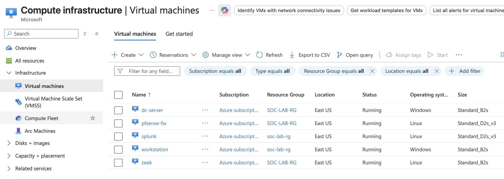
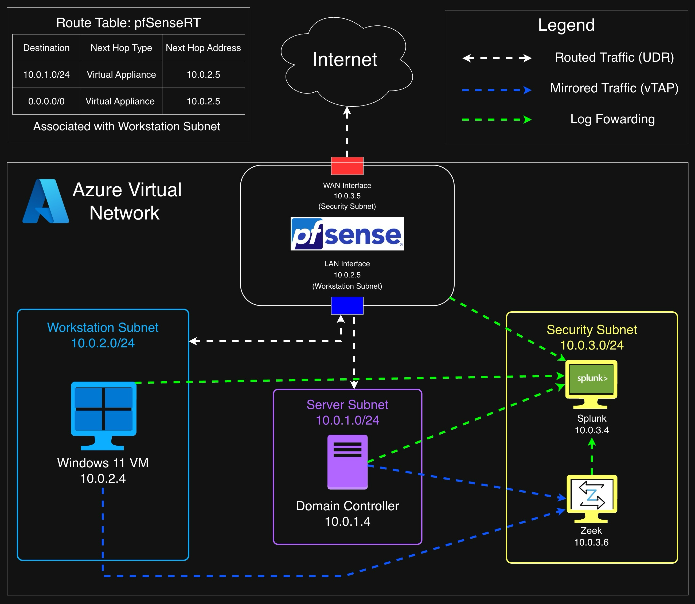
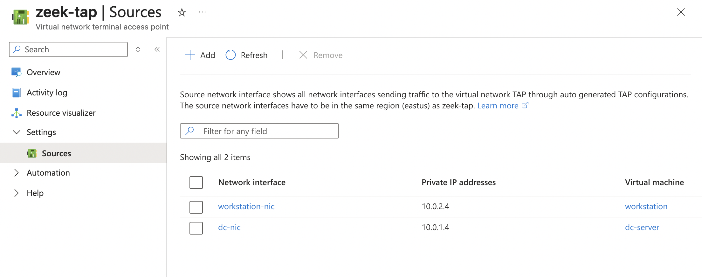
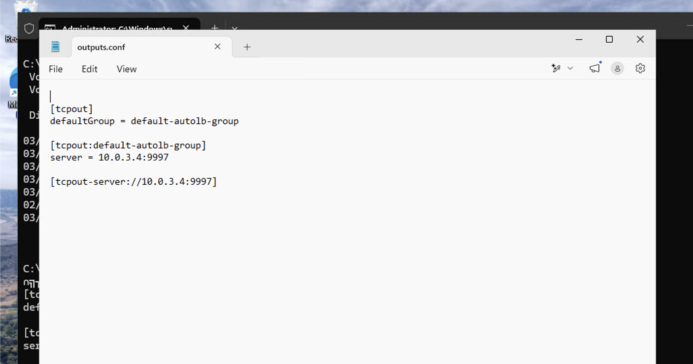
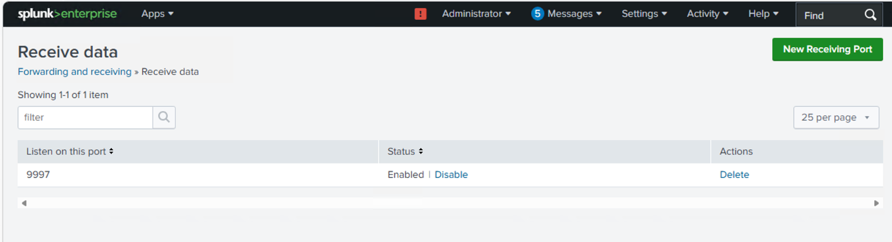
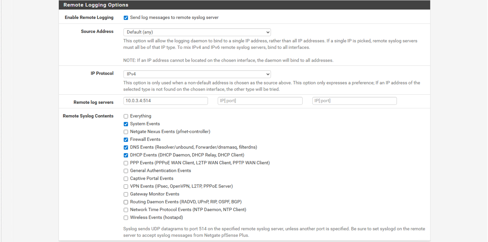

# 🏗️ Architecture Overview

---

## 📌 Overview

This lab environment was built in Microsoft Azure to simulate a real-world enterprise network and support detection engineering, alerting, and incident investigation workflows.

The architecture includes segmented networks, controlled traffic flows, network traffic monitoring through Azure Virtual Network TAP, and centralized log ingestion into Splunk, enabling visibility across both endpoint and network activity.

---

## ☁️ Azure Environment

### Virtual Network Design

A virtual network was deployed within a dedicated resource group and segmented into three subnets. This segmentation separates user, server, and security infrastructure while enabling controlled traffic flow and centralized monitoring across the environment.

#### 🗄️ Server Subnet (`10.0.1.0/24`)

- Domain Controller

#### 🖥️ Workstation Subnet (`10.0.2.0/24`)

- Windows Workstation
- pfSense LAN interface

#### 🔐 Security Subnet (`10.0.3.0/24`)

- pfSense WAN interface
- Splunk Server
- Zeek Sensor

---

### 🖥️ Virtual Machine Deployment

All components were deployed as Azure Virtual Machines, with Marketplace images used where applicable to simplify provisioning.

### System Roles

- **Workstation VM**
  - Simulates user activity and attack origin

- **Domain Controller VM**
  - Provides authentication and directory services

- **Splunk VM**
  - Provides centralized logging, detection, and alerting

- **Zeek VM**
  - Provides network monitoring and traffic analysis

- **pfSense VM**
  - Provides firewall and routing control

### 📸 Azure VM Infrastructure

_Azure VM inventory showing the five virtual machines supporting the SOC lab environment._

> Public IP addresses are omitted/redacted in the portfolio version of this screenshot.

---

### 📸 Azure Network Layout

_High-level network architecture showing subnet segmentation, routing, security infrastructure, and monitoring components._

---

### Routing and Traffic Control

A custom Azure route table was configured to control traffic flow between subnets.

#### 🔹 Key Behavior

- Traffic from the workstation subnet is routed through pfSense
- pfSense acts as the central gateway for outbound traffic
- Internal communication between the workstation and Domain Controller is routed through pfSense
- Selected traffic flows are inspected and logged by pfSense
- Mirrored traffic is separately analyzed by Zeek

#### 🔹 Monitoring Impact

This routing design enables:

- Visibility into lateral movement attempts
- Inspection of outbound connections
- Firewall-based network telemetry
- Correlation between network and endpoint activity

---

## 🌐 Network Traffic and Monitoring

### Traffic Flow

The environment simulates realistic enterprise communication patterns:

- Workstation → Domain Controller
  - DNS
  - Kerberos
  - LDAP
  - SMB
  - RPC
- Workstation → Internet via pfSense

Traffic between the workstation and Domain Controller is routed through pfSense, while selected network interfaces are mirrored to Zeek for network-level analysis.

---

### Traffic Monitoring — Azure Virtual Network TAP

Azure Virtual Network TAP was configured to mirror traffic from the following network interfaces:

- `workstation-nic` — `10.0.2.4`
- `dc-nic` — `10.0.1.4`

The mirrored traffic is delivered to the Zeek monitoring infrastructure for network analysis.

### 📸 vTAP Source Configuration

_Azure Virtual Network TAP configured with the workstation and Domain Controller network interfaces as traffic sources._

The TAP configuration provides visibility into traffic originating from both the workstation and Domain Controller without placing Zeek inline with production traffic.

---

## 📥 Log Sources

### Windows Logs

Windows telemetry is collected from:

- Workstation
- Domain Controller

Key events include:

- Event ID 4688 — Process Creation
- Event ID 4625 — Failed Logon
- Event ID 4720 — Account Creation
- Event ID 4728 — Privileged Group Membership Modification

Windows event data is forwarded to Splunk using the Splunk Universal Forwarder.

---

### Zeek Logs

Zeek analyzes mirrored network traffic and generates network telemetry including:

- DNS activity
- Connection activity
- Destination ports
- Network services
- Connection states

Zeek telemetry is forwarded to Splunk for centralized analysis and detection.

---

### pfSense Logs

pfSense provides firewall and network telemetry including:

- Firewall allow/deny events
- DNS events
- DHCP events
- System events
- Network connection activity

These logs are forwarded to Splunk using remote syslog.

---

## 🔄 Log Ingestion Pipeline

### Data Flow

The environment uses multiple telemetry pipelines that converge in Splunk:

- **Windows → Splunk Universal Forwarder → Splunk**
- **Zeek → Local Forwarding → Splunk**
- **pfSense → UDP Syslog → Splunk**

### Pipeline Summary

1. Endpoint and network activity is generated within the environment
2. Windows, Zeek, and pfSense collect telemetry
3. Logs are forwarded to Splunk
4. Splunk indexes the incoming data
5. Detection logic is applied to identify abnormal activity
6. Scheduled alerts are triggered when detection conditions are met

---

### Windows Universal Forwarder → Splunk

The Windows Universal Forwarder is configured to send collected telemetry to the Splunk server at `10.0.3.4:9997`.

### 📸 Universal Forwarder Configuration

_Windows Universal Forwarder `outputs.conf` showing the Splunk receiving server at `10.0.3.4:9997`._

The `outputs.conf` file defines the receiving destination for the Universal Forwarder. :chatgpt-content-reference{index="0"}

---

### Splunk Receiving Configuration

Splunk Enterprise is configured to receive forwarded data on TCP port `9997`.

### 📸 Splunk Receiving Configuration

_Splunk Enterprise receiving configuration showing TCP port `9997` enabled._

This provides the receiving endpoint for the Windows Universal Forwarder.

---

### pfSense → Splunk Syslog

pfSense forwards selected system and network events to the Splunk server at `10.0.3.4:514` using UDP syslog.

### 📸 pfSense Remote Logging Configuration

_pfSense Remote Logging configuration showing Splunk at `10.0.3.4:514` as the remote syslog destination._

The configured remote syslog categories include:

- System Events
- Firewall Events
- DNS Events
- DHCP Events

pfSense uses UDP for its built-in remote syslog functionality, with port `514` as the default syslog port. :chatgpt-content-reference{index="1"}

---

## 🔍 Detection and Alerting

### Detection Layer

Detection logic is implemented in Splunk using SPL queries against Windows, Zeek, and pfSense log sources.

These detections identify behaviors associated with multiple stages of the attack lifecycle, including:

- Reconnaissance
- Suspicious execution
- Service discovery
- Brute-force attempts
- Lateral movement
- Persistence

---

### Alerting Layer

Alerts are configured as scheduled searches:

- Run every 5 minutes
- Evaluate recent telemetry
- Trigger when detection conditions are met
- Assigned severity levels of Medium or High

The alerting layer provides automated notification when suspicious activity matches defined detection logic.

---

## 📊 Visualization Layer

Dashboards provide visibility into key activity across endpoint, network, and authentication data.

Panels are built on top of detection queries and highlight patterns such as:

- Host activity
  - Process execution
  - PowerShell usage
- Network behavior
  - DNS queries
  - Connection patterns
  - Port activity
- Authentication trends
  - Failed logons
  - Brute-force attempts

These visualizations support investigation by enabling correlation across multiple data sources and highlighting abnormal activity patterns.

---

## ⚙️ Configuration Summary

### 🔥 pfSense

#### Firewall Aliases

**`AD_Standard_Ports`**

- 53
- 88
- 123
- 135
- 389
- 445
- 3389
- 49668–49923

---

#### Firewall Rules

1. Allow Authorized AD Traffic
2. Block Unauthorized Lateral Movement
3. Default Allow LAN

---

#### Remote Logging — pfSense → Splunk

- Server: `10.0.3.4:514`
- Protocol: UDP
- Log Categories:
  - System Events
  - Firewall Events
  - DNS Events
  - DHCP Events

---

### 🌐 Zeek

- Receives mirrored traffic through Azure Virtual Network TAP
- Monitors traffic from the workstation and Domain Controller
- Generates DNS and connection logs
- Forwards network telemetry to Splunk

---

### 📊 Splunk

#### Indexes

- `windows`
- `zeek`
- `firewall`

#### Data Sources

- Windows Universal Forwarder
- Zeek logs
- pfSense syslog

#### Receiving Configuration

- TCP `9997` — Windows Universal Forwarder
- UDP `514` — pfSense syslog

---

## 🧠 Summary

This architecture enables:

- Centralized visibility across endpoint and network activity
- Detection of attacker behavior across multiple stages
- Correlation between host and network telemetry
- Firewall-based network monitoring
- Network traffic analysis through Zeek
- Automated alerting through Splunk

The integration of Azure networking, pfSense routing, Azure Virtual Network TAP, Zeek monitoring, and Splunk analytics provides a complete SOC-style monitoring environment.
