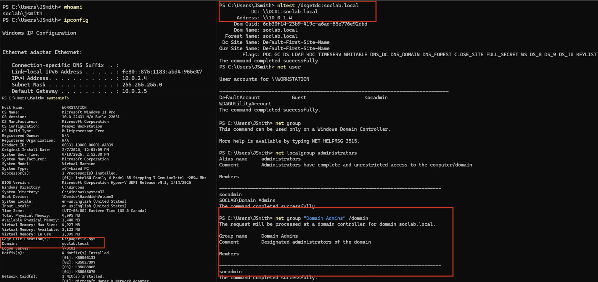
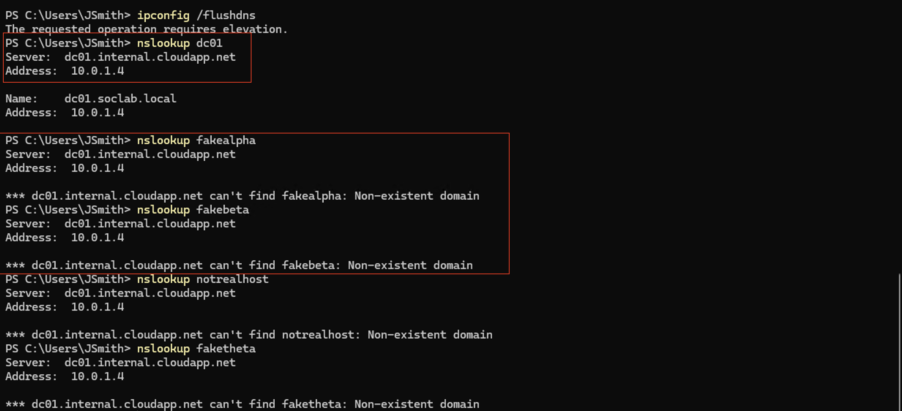
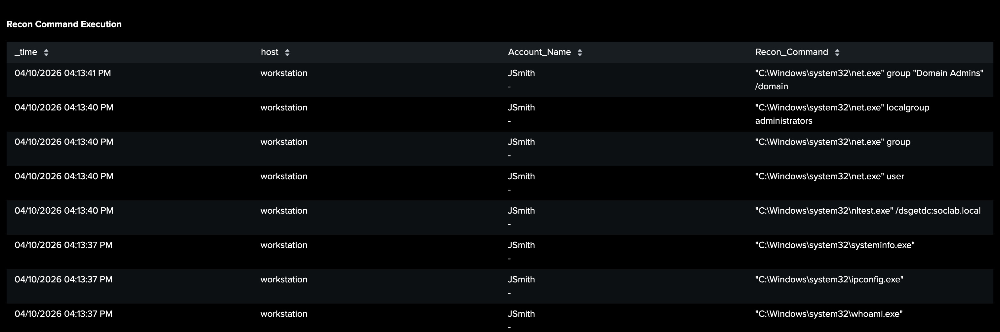
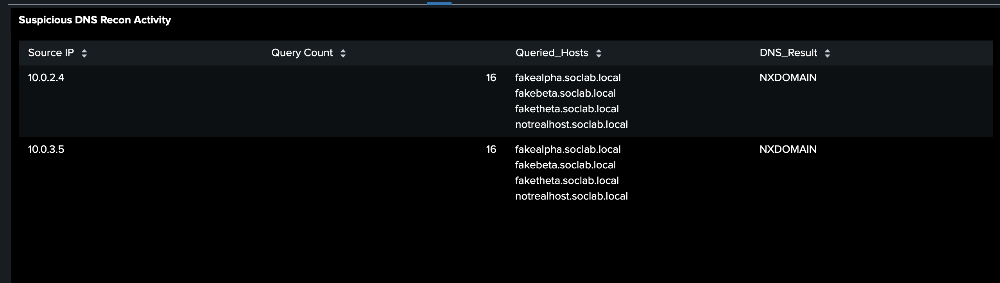

# 🔍 Investigation 1 – Reconnaissance Activity

---

## 📌 Overview

This phase captures early-stage attacker behavior focused on **environment discovery and enumeration**. The objective of the attacker is to gather information about the system, domain structure, and potential high-value targets.

Observed activity includes host-level reconnaissance commands and network-based DNS queries used to identify internal resources.

---

## 🧪 Attacker Activity

### 📸 Host-Based Reconnaissance

The following commands were executed from the compromised workstation:

```powershell
whoami
ipconfig
systeminfo
nltest /dsgetdc:soclab.local
net user
net group
net localgroup administrators
net group "Domain Admins" /domain
```

---



**Description:**
This screenshot captures the execution of multiple native Windows commands used to gather system and domain information. The attacker enumerates the environment to identify domain structure, key infrastructure, and privileged accounts.

**Key Evidence:**

- **Domain Identification:** `systeminfo` reveals the domain (`soclab.local`)
- **Domain Controller Discovery:** `nltest` identifies the domain controller (`dc01`) and its IP address (`10.0.1.4`)
- **Privileged Account Enumeration:** `net group "Domain Admins"` exposes high-value accounts (e.g., `socadmin`)

This activity represents early-stage reconnaissance used to inform subsequent attack phases.

---

### 🌐 Network-Based Reconnaissance (Zeek)

Network telemetry reveals additional reconnaissance through DNS query activity originating from the same host.



**Description:**
This screenshot displays DNS query activity captured by Zeek, showing abnormal query volume and repeated failed lookups originating from a single internal host.

**Key Evidence:**

- **Baseline Validation:** `nslookup dc01` confirms DNS resolution for a known internal host (`dc01.soclab.local`) and establishes expected response behavior
- **NXDOMAIN Responses:** Suggests probing for non-existent or guessed hostnames
- **Suspicious Hostnames:** Queries such as `fake*` and `notreal*` indicate enumeration attempts

This pattern is consistent with internal network mapping and host discovery.

---

### Key Observations:

- The attacker leveraged native Windows commands to perform reconnaissance while minimizing detection risk
- Domain membership information was used to guide further enumeration and targeting
- The domain controller and privileged accounts were identified as primary targets for subsequent attack phases

---

## 🔎 Detection

### 📸 Reconnaissance Command Execution (Windows Logs)

This panel identifies suspicious enumeration activity using Windows Event ID **4688** (process creation), capturing commands executed on the compromised host during the earlier command-based reconnaissance phase.

🔗 **Detection Details:** [View Detection Logic](../detections/recon_command.md)



**Key Evidence:**

- **Executed Commands:** Enumeration commands observed (`whoami`, `systeminfo`, `nltest`, `net group`)
- **User Context:** Activity performed by `JSmith`
- **Execution Pattern:** Multiple commands executed within seconds

---

### 📸 Suspicious DNS Recon Activity (Zeek)

This panel highlights abnormal DNS behavior indicative of reconnaissance, including high query volume and failed lookups.

🔗 **Detection Details:** [View Detection Logic](../detections/dns_recon.md)



**Key Evidence:**

- **Query Volume:** High number of DNS requests from a single host
- **NXDOMAIN Responses:** Repeated failed lookups
- **Query Pattern:** Mix of valid and invalid hostnames indicating probing behavior

---

## 🚨 Alert

### 📸 Suspicious DNS Recon Activity Alert

This alert was triggered as a direct result of the DNS-based reconnaissance activity observed earlier, where repeated hostname queries and NXDOMAIN responses indicated internal enumeration behavior.

🔗 **Alert Logic:** [View Alert Configuration](../alerts/sus_dns_alert.md)


**Key Evidence:**

- **Trigger Conditions:** High DNS query volume combined with repeated NXDOMAIN responses
- **Source Host:** Identifies the same workstation observed in earlier DNS reconnaissance activity
- **Time Correlation:** Alert timing aligns with both command-based and DNS-based reconnaissance

---

## 🧠 Analysis

This activity represents a classic **reconnaissance phase**, where the attacker gathers information about the environment before attempting further actions.

The attacker first identified domain membership using local system information (`systeminfo`), then leveraged this knowledge to query the domain controller using `nltest`. Privileged accounts were subsequently identified through group enumeration.

Key indicators include:

- Use of native Windows commands for stealth (living off the land)
- Enumeration of domain users and privileged groups
- Identification of the domain controller as a high-value target
- DNS-based probing to discover internal systems

The combination of **endpoint telemetry (process execution)** and **network telemetry (DNS activity)** provides strong evidence of coordinated reconnaissance behavior.

Importantly, the information gathered in this phase directly enables subsequent attack stages, including credential targeting, lateral movement, and privilege abuse.

---

## 🧭 MITRE ATT&CK Mapping

| Technique ID | Technique Name            | Description                          |
| ------------ | ------------------------- | ------------------------------------ |
| T1087        | Account Discovery         | Enumerating domain users and groups  |
| T1018        | Remote System Discovery   | Identifying domain controller        |
| T1046        | Network Service Discovery | DNS-based host and service discovery |

---

## 🏁 Conclusion

The reconnaissance phase successfully identified:

- Domain structure (`soclab.local`)
- High-value accounts (Domain Admins → `socadmin`)
- Critical infrastructure (Domain Controller → `dc01`)

This information directly enabled the attacker to transition into **credential targeting and lateral movement**, which are observed in subsequent phases of the investigation.
