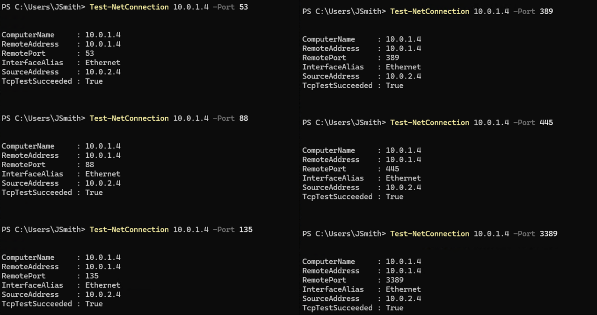
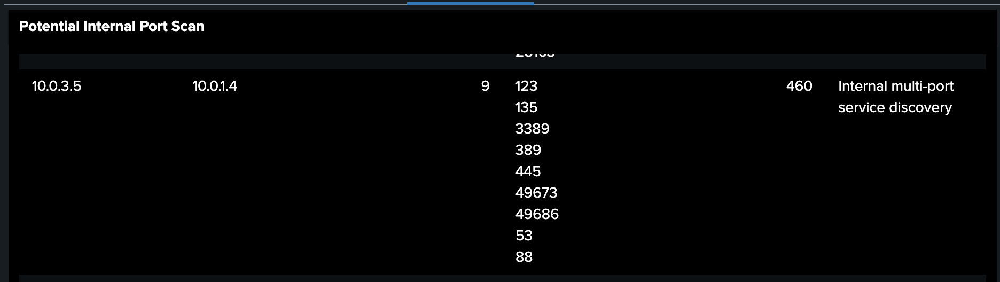
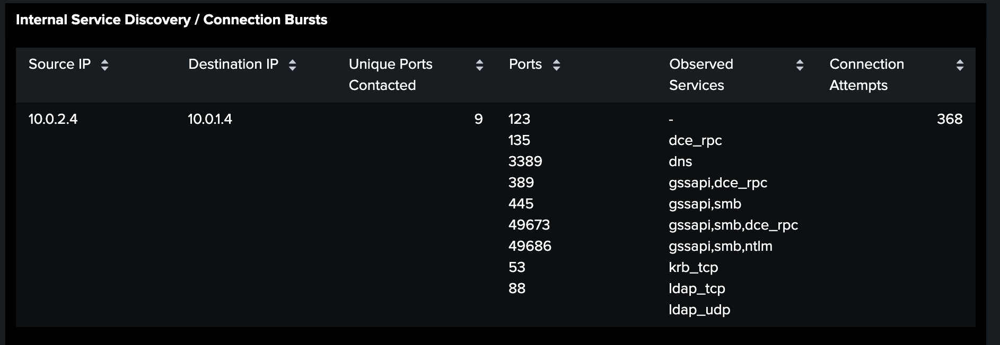

# 🔍 Investigation 3 – Internal Discovery

---

## 📌 Overview

This phase captures internal reconnaissance activity following initial access and environment enumeration. The attacker probes internal systems to identify available services and potential targets for lateral movement.

The observed behavior is consistent with **internal network discovery and service enumeration**, focusing on identifying accessible resources within the domain.

---

## 🧪 Attacker Activity

---

### 📸 Service Enumeration (SMB)

The attacker performed multiple connection attempts against the domain controller to identify accessible services and determine potential attack paths.

```powershell
Test-NetConnection 10.0.1.4 -Port 53
Test-NetConnection 10.0.1.4 -Port 88
Test-NetConnection 10.0.1.4 -Port 135
Test-NetConnection 10.0.1.4 -Port 389
Test-NetConnection 10.0.1.4 -Port 445
Test-NetConnection 10.0.1.4 -Port 3389
```



**Description:**
The attacker probes multiple well-known ports on the domain controller to identify active services and determine viable methods for further access.

**Key Evidence:**

- **Target System:** `10.0.1.4` (Domain Controller)
- **Source System:** `10.0.2.4` (Compromised Workstation)
- **Ports Probed:**
  - 53 (DNS)
  - 88 (Kerberos)
  - 135 (RPC)
  - 389 (LDAP)
  - 445 (SMB)
  - 3389 (RDP)
- **Successful Connections:** Multiple services responded (`TcpTestSucceeded: True`)
- **Enumeration Behavior:** Sequential probing of common Active Directory services

---

## 🔎 Detection

---

### 📸 Potential Internal Port Scan (Zeek)

This detection identifies internal port scanning activity originating from the compromised host, targeting multiple services on the domain controller.

🔗 **Detection Details:** [View Detection Logic](../detections/internal_port_scan.md)



**Key Evidence:**

- **Source → Destination:** `10.0.2.4 → 10.0.1.4`
- **Ports Targeted:** 53, 88, 123, 135, 389, 445, 3389, and high ephemeral ports
- **Scan Behavior:** Multiple ports probed on a single host
- **Technique Indicator:** Consistent with internal port scanning activity

---

### 📸 Internal Service Discovery / Connection Bursts

This detection highlights high-volume connection attempts to multiple services, indicating systematic service enumeration.

🔗 **Detection Details:** [View Detection Logic](../detections/service_discovery.md)



**Key Evidence:**

- **Source IP:** `10.0.2.4`
- **Target IP:** `10.0.1.4`
- **Unique Ports Contacted:** 9
- **Connection Attempts:** 368
- **Observed Services:**
  - DNS (53)
  - Kerberos (88)
  - RPC (135)
  - LDAP (389)
  - SMB (445)
  - RDP (3389)
- **Behavior Pattern:** High-volume, multi-port connection bursts

---

## 🚨 Alert

---

### 📸 Potential Internal Port Scan Detected

This alert was triggered based on multi-port connection attempts originating from a single internal host, indicating potential port scanning activity.

🔗 **Alert Logic:** [View Alert Configuration](../alerts/internal_port_scan_alert.md)


**Key Evidence:**

- **Alert Severity:** Medium
- **Source Host:** `10.0.2.4`
- **Target Host:** `10.0.1.4`
- **Ports Targeted:** Multiple (53, 88, 135, 389, 445, 3389, etc.)
- **Behavior Pattern:** Sequential probing across multiple ports

---

### 📸 Internal Service Discovery / Connection Burst

This alert was triggered due to a high volume of internal connection attempts across multiple services within a short timeframe, consistent with automated service enumeration.

🔗 **Alert Logic:** [View Alert Configuration](../alerts/service_discovery_alert.md)


**Key Evidence:**

- **Alert Severity:** Medium
- **Source Host:** `10.0.2.4`
- **Target Host:** `10.0.1.4`
- **Connection Attempts:** 300+ within a short timeframe
- **Services Identified:** DNS, Kerberos, RPC, LDAP, SMB, RDP
- **Behavior Pattern:** High-frequency multi-service probing

---

## 🧠 Analysis

This phase represents the attacker’s transition from general reconnaissance to targeted internal discovery.

Key indicators include:

- Identification of accessible services on the domain controller (SMB)
- Repeated internal connection attempts indicating enumeration behavior
- Network telemetry confirming systematic probing of internal systems

By confirming that SMB (port 445) is accessible on the domain controller, the attacker identifies a viable method for lateral movement.

This discovery directly informs the next phase, where the attacker attempts to authenticate using the identified service.

---

## 🧭 MITRE ATT&CK Mapping

| Technique ID | Technique Name            | Description                            |
| ------------ | ------------------------- | -------------------------------------- |
| T1046        | Network Service Discovery | Probing services on internal systems   |
| T1018        | Remote System Discovery   | Identifying reachable internal systems |

---

## 🏁 Conclusion

The internal discovery phase enables the attacker to identify viable targets and services within the environment.

This information directly supports the next phase, where the attacker attempts to gain access through **credential abuse and authentication attempts**.
