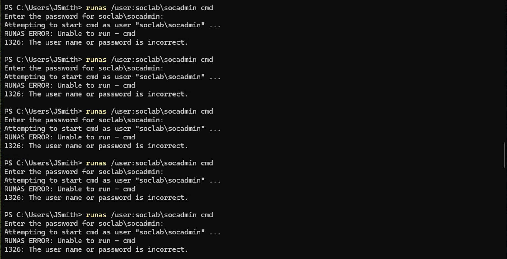
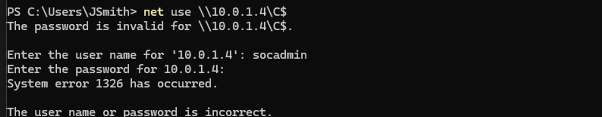
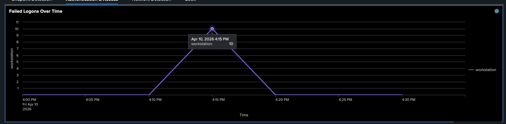
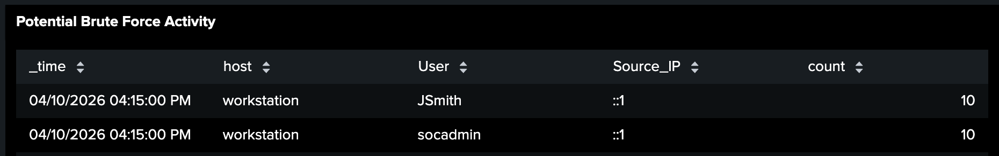
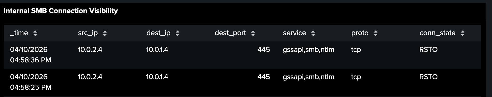
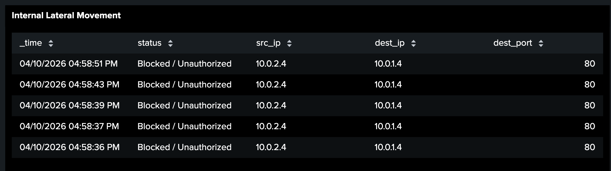
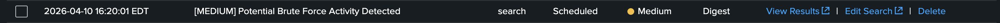

# 🔐 Investigation 4 – Credential Abuse

---

## 📌 Overview

This phase captures authentication-related activity targeting a privileged account within the domain. The attacker attempts to gain access using credentials identified during reconnaissance.

The observed behavior is consistent with **brute-force or password guessing attempts**, resulting in repeated failed authentication events.

---

## 🧪 Attacker Activity

---

### 📸 Failed Authentication Attempts

The attacker attempted to authenticate using a privileged account identified during reconnaissance.

```powershell
runas /user:soclab\socadmin cmd
```



**Description:**
Repeated authentication attempts were made against the `socadmin` account, indicating efforts to gain unauthorized access.

**Key Evidence:**

- **Target Account:** `socadmin` identified as a Domain Admin
- **Repeated Failures:** Multiple failed logon attempts within a short timeframe
- **Source Context:** Attempts originate from the compromised workstation

---

### 📸 Failed SMB Authentication

The attacker attempted to access the domain controller using SMB with invalid credentials.

```powershell
net use \\10.0.1.4\C$
```



**Description:**
An attempt to access the administrative share on the domain controller failed due to incorrect credentials.

**Key Evidence:**

- **Target System:** Domain controller (`10.0.1.4`)
- **Access Attempt:** SMB share (`C$`)
- **Authentication Failure:** Indicates invalid or incorrect credentials

---

## 🔎 Detections

---

### 📸 Failed Logons (Windows Logs)

This panel identifies repeated failed authentication attempts associated with the earlier credential abuse activity.

🔗 **Detection Details:** [View Detection Logic](../detections/failed_logon_detection.md)



**Key Evidence:**

- **Event ID 4625:** Failed logon attempts
- **Target Account:** `socadmin`
- **Source Host:** Workstation generating authentication attempts
- **Failure Pattern:** Multiple failures within a short timeframe

---

### 📸 Brute Force Pattern

This panel highlights abnormal authentication patterns associated with the earlier failed logon activity, indicating potential brute-force attempts.

🔗 **Detection Details:** [View Detection Logic](../detections/failed_logon_detection.md)



**Key Evidence:**

- **Targeted Account:** High volume of failed attempts against `socadmin`
- **Execution Context:** Presence of `JSmith` reflects the compromised user initiating the attempts
- **Time Clustering:** Multiple failures occurring within a short timeframe indicate brute-force behavior

---

### 📸 SMB Connection Attempts (Zeek)

This detection highlights repeated SMB connection attempts to the domain controller observed during credential abuse activity.

🔗 **Detection Details:** [View Detection Logic](../detections/smb_connection_detection.md)



**Key Evidence:**

- **Source → Destination:** `10.0.2.4 → 10.0.1.4`
- **Port:** 445 (SMB)
- **Connection State:** `RSTO` indicates connection reset
- **Pattern:** Multiple failed connection attempts in short succession

---

### 📸 Blocked Internal Lateral Movement (Network)

This detection captures repeated internal connection attempts that were blocked or unauthorized, indicating failed lateral movement attempts.

🔗 **Detection Details:** [View Detection Logic](../detections/lateral_movement_blocked.md)



**Key Evidence:**

- **Status:** Blocked / Unauthorized
- **Source IP:** `10.0.2.4` (compromised host)
- **Target IP:** `10.0.1.4` (domain controller)
- **Pattern:** Repeated connection attempts within a short timeframe

---

## 🚨 Alert

---

### 📸 Potential Brute Force Activity Alert

This alert was triggered based on repeated failed authentication attempts observed during the credential abuse phase.

🔗 **Alert Logic:** [View Alert Configuration](../alerts/bruteforce_alert.md)



**Key Evidence:**

- **Trigger Conditions:** High volume of failed logons
- **Target Account:** `socadmin`
- **Source Host:** Compromised workstation
- **Time Correlation:** Aligns with observed authentication attempts

---

## 🧠 Analysis

This phase demonstrates the attacker’s attempt to gain access through credential abuse following reconnaissance.

Key indicators include:

- Targeting of a privileged account identified earlier
- Repeated failed authentication attempts consistent with brute-force behavior
- Attempts to access critical systems (domain controller) using invalid credentials
- Network telemetry confirms repeated SMB connection failures and blocked internal access attempts

The presence of both `JSmith` and `socadmin` reflects the execution context of the attack, where the compromised user (`JSmith`) is attempting to authenticate as a privileged account (`socadmin`).

The lack of successful authentication in this phase suggests that the attacker has not yet obtained valid credentials but is actively attempting to do so.

The combination of endpoint and network telemetry provides strong evidence of coordinated credential abuse and attempted lateral movement.

---

## 🧭 MITRE ATT&CK Mapping

| Technique ID | Technique Name | Description                      |
| ------------ | -------------- | -------------------------------- |
| T1110        | Brute Force    | Repeated authentication attempts |

---

## 🏁 Conclusion

The credential abuse phase shows the attacker actively attempting to gain access to privileged accounts through repeated authentication failures.

These failed attempts set the stage for eventual success, leading to **lateral movement in the next phase of the investigation**.
