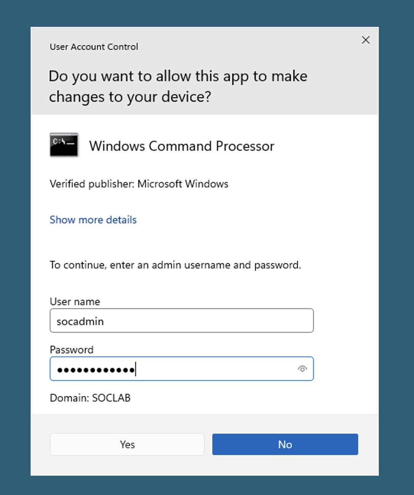
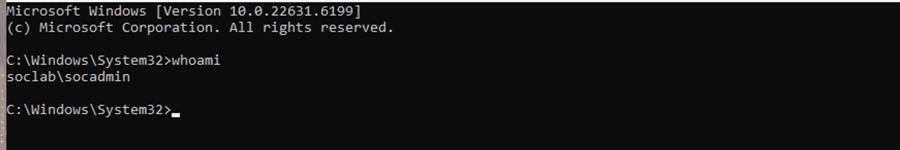

# 🚀 Investigation 5 – Lateral Movement

---

## 📌 Overview

This phase captures the attacker using compromised domain administrator credentials to pivot from the compromised workstation to a privileged domain context.

After obtaining the credentials for the `socadmin` account, the attacker uses them to launch a Command Prompt under the `socadmin` security context on the compromised workstation. This provides the attacker with domain administrator privileges, allowing them to perform administrative actions and prepare the environment for persistence.

This behavior is consistent with **lateral movement using valid accounts**, where legitimate credentials are leveraged to blend in with normal administrative activity.

---

## 🧪 Attacker Activity

---

### 📸 Command Prompt Opened as Domain Administrator

The attacker uses the compromised `socadmin` credentials to launch Command Prompt as Administrator.



**Description:**

The attacker enters the compromised domain administrator credentials (`SOCLAB\socadmin`) to launch a Command Prompt under the domain administrator's security context.

**Key Evidence:**

- **User:** `SOCLAB\socadmin`
- **Authentication Method:** Windows **Run as Administrator**
- **Application:** `cmd.exe`
- **Host:** `10.0.2.4` (Compromised Workstation)
- **Result:** Administrative Command Prompt successfully launched

---

### 📸 Administrative Access Confirmed

The attacker verifies the security context of the newly opened Command Prompt.

```powershell
whoami
```



**Description:**

The `whoami` command confirms that the Command Prompt is running under the compromised `socadmin` account, verifying successful administrative access.

**Key Evidence:**

- **Current User:** `soclab\socadmin`
- **Execution Context:** Domain Administrator
- **Application:** `cmd.exe`
- **Host:** `10.0.2.4` (Compromised Workstation)
- **Result:** Administrative access confirmed

---

## 🧠 Analysis

This phase confirms that the attacker has successfully performed lateral movement by leveraging valid domain administrator credentials.

By authenticating as `socadmin` and obtaining an elevated Command Prompt, the attacker now has full administrative capabilities over domain resources. This level of access enables the attacker to modify Active Directory objects, create new accounts, assign administrative privileges, and perform additional actions required to maintain long-term persistence.

Unlike earlier phases that generated security detections, this activity relies on legitimate credentials. As a result, successful administrative access may not generate a dedicated detection in this lab, requiring analysts to correlate previous attacker activity with subsequent administrative actions.

---

## 🧭 MITRE ATT&CK Mapping

| Technique ID | Technique Name  | Description                                                                    |
| ------------ | --------------- | ------------------------------------------------------------------------------ |
| T1078        | Valid Accounts  | Use of legitimate domain administrator credentials to obtain privileged access |
| T1021        | Remote Services | Use of valid credentials to facilitate movement within the environment         |

---

## 🏁 Conclusion

The lateral movement phase demonstrates the attacker's successful transition from a compromised workstation to a privileged administrative context.

With domain administrator access established under the `socadmin` account, the attacker is positioned to establish persistence by creating a new privileged account and maintaining long-term access to the Active Directory environment.
