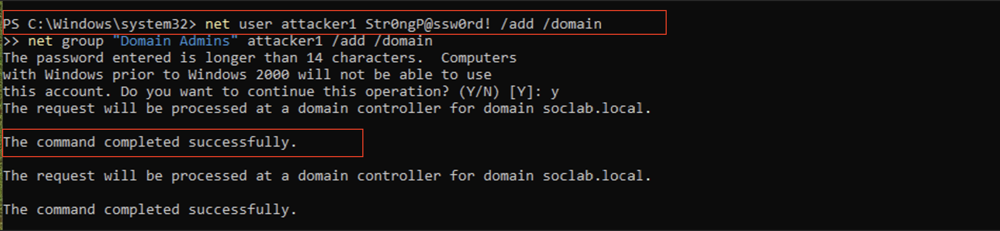
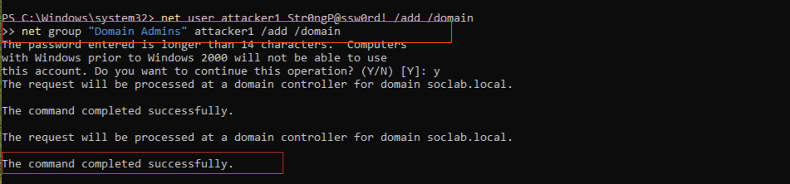
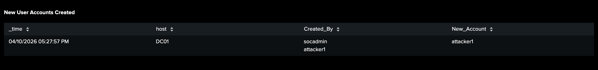
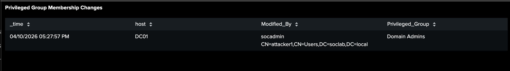

# 🔒 Investigation 6 – Persistence

---

## 📌 Overview

This phase captures actions taken by the attacker to maintain long-term access within the environment after successfully compromising the domain controller.

Following lateral movement and administrative access, the attacker establishes persistence by creating a new privileged account within the domain.

This behavior ensures continued access even if the original compromised credentials are detected or disabled.

---

## 🧪 Attacker Activity

---

### 📸 Account Creation

The attacker creates a new domain account to maintain access.

```powershell
net user attacker1 Str0ngP@ssword123! /add /domain
```



**Description:**
A new domain user account is created to establish persistent access within the environment.

**Key Evidence:**

- **New Account:** `attacker1`
- **Scope:** Domain account
- **Action:** Account creation using administrative privileges
- **Purpose:** Establish alternate access path

---

### 📸 Privilege Escalation (Account Added to Domain Admins)

The attacker elevates the newly created account to a privileged role.

```powershell
net group "Domain Admins" attacker1 /add /domain
```



**Description:**
The attacker adds the newly created account to the Domain Admins group, granting full administrative privileges.

**Key Evidence:**

- **Account:** `attacker1`
- **Group:** Domain Admins
- **Privilege Level:** Full administrative access
- **Impact:** Persistent privileged access established

---

## 🔎 Detection

---

### 📸 Account Creation Detection (Windows Logs)

This detection captures the creation of new user accounts within the domain.

🔗 **Detection Details:** [View Detection Logic](../detections/account_creation.md)



**Key Evidence:**

- **Event ID 4720:** User account created
- **New Account:** `attacker1`
- **Created By:** Privileged account
- **Target System:** Domain controller

---

### 📸 Privileged Group Modification Detection

This detection identifies changes to privileged groups within the domain.

🔗 **Detection Details:** [View Detection Logic](../detections/privilage_escalation.md)



**Key Evidence:**

- **Event ID 4728:** Member added to security-enabled global group
- **Group:** Domain Admins
- **Added Account:** `attacker1`
- **Privilege Escalation:** Confirmed

---

## 🚨 Alert

---

### 📸 New User Account Created Alert

This alert was triggered after a new domain user account was created during the persistence phase of the attack.

🔗 **Alert Logic:** [View Alert Configuration](../alerts/account_created_alert.md)


**Key Evidence:**

- **Alert Severity:** Medium
- **Event ID:** 4720
- **New Account:** `attacker1`
- **Created By:** `Administrator`
- **Risk:** Potential persistence through unauthorized account creation

---

### 📸 Privileged Group Membership Modified Alert

This alert was triggered after the newly created account was added to the **Domain Admins** group, granting it administrative privileges.

🔗 **Alert Logic:** [View Alert Configuration](../alerts/privileged_group_alert.md)


**Key Evidence:**

- **Alert Severity:** High
- **Event ID:** 4728
- **Affected Account:** `attacker1`
- **Modified Group:** `Domain Admins`
- **Risk:** Privilege escalation resulting in persistent administrative access

---

## 🧠 Analysis

This phase confirms that the attacker has established persistence within the environment by creating and elevating a new domain account.

Key indicators include:

- Creation of a new domain account using administrative privileges
- Immediate elevation of the account to Domain Admin status
- Establishment of an alternate access path independent of the original compromised account

This behavior ensures that the attacker can retain access even if the initial compromise is detected and remediated.

---

## 🧭 MITRE ATT&CK Mapping

| Technique ID | Technique Name       | Description                        |
| ------------ | -------------------- | ---------------------------------- |
| T1136        | Create Account       | Creation of a new domain account   |
| T1098        | Account Manipulation | Adding account to privileged group |

---

## 🏁 Conclusion

The persistence phase demonstrates that the attacker has secured long-term access to the environment through the creation and elevation of a privileged account.

This represents a critical security risk, as it allows continued unauthorized access even after initial indicators of compromise are addressed.
